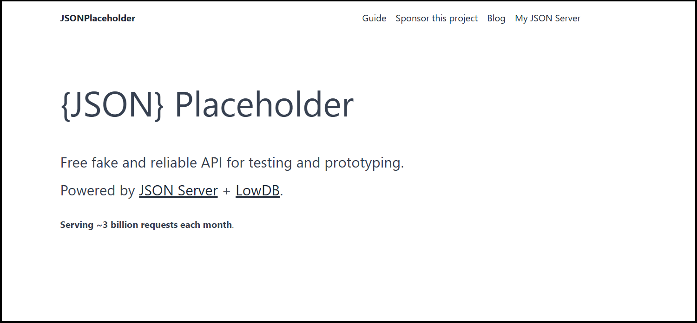
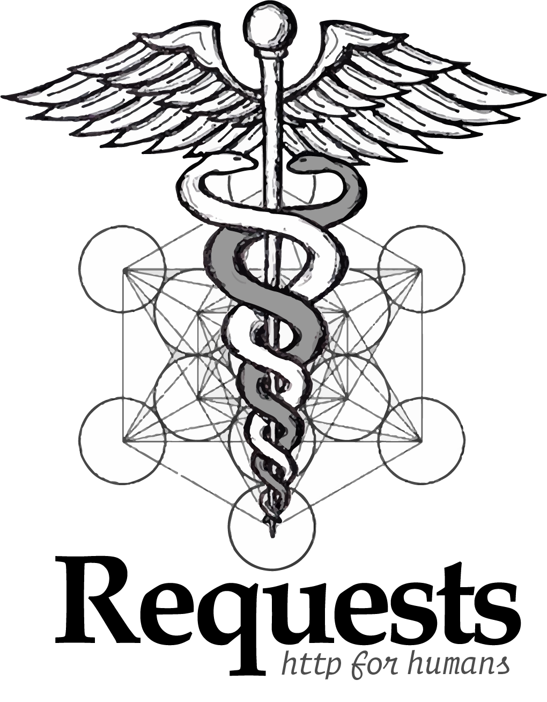
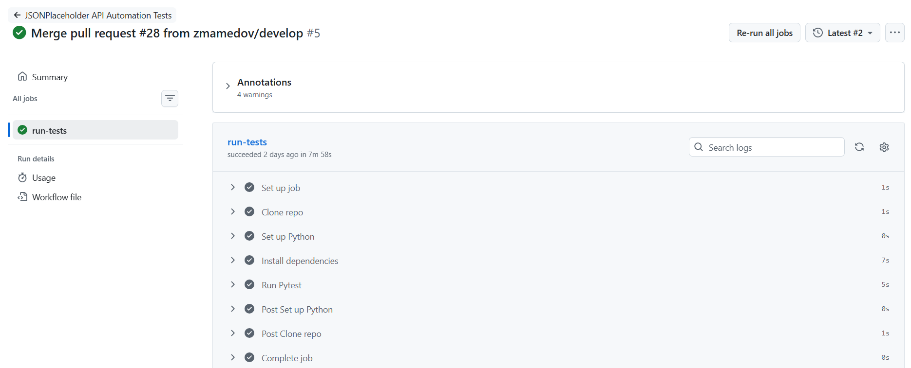

# JSONPlaceholder API Automation Project

## Introduction

A test automation framework for testing the [**JSONPlaceholder REST API**](https://jsonplaceholder.typicode.com) service. This project demonstrates test automation architecture patterns, schema validation and clean code practices.



---

## 🏗️ Architecture & Design Patterns

The framework is built using a **4-Layer Decoupled Architecture** to ensure maximum maintainability, scalability, and readability:

1. **Data Layer (`PostData`)**: Implements the **Data Factory** pattern. It completely isolates test data from the test logic.
2. **API Client Layer (`PostsApi`)**: Encapsulates raw HTTP communication using the `requests` library, hiding technical details like endpoints and headers from the test logic (API Client Wrapper pattern).
3. **Fluent Assertions Layer (`PostsAssert`)**: Implements a **Fluent API** pattern.
4. **Test Layer (`tests/`)**: Contains high-level, human-readable test scenarios completely isolated from raw infrastructure details.

---

## 🛠️ Tech Stack

    

* **Language:** Python 3.10+
* **Test Runner:** Pytest
* **HTTP Client:** Requests
* **Data Validation:** Pydantic v2 (Strict type and schema enforcement)
* **Test Data Generation:** Faker

## 📂 Project Structure

```text
jsonplaceholder_api_pytest/
├── .github/workflows/
│   └── tests.yml
├── jsonplaceholder_api_pytest/
|   ├── api/
│   │   ├── assertions/
│   │   ├── clients/
│   ├── data/
│   ├── schemas/
├── tests/
│   ├── conftest.py
│   ├── test_smoke.py
│   ├── test_functional.py
│   ├── test_negative.py
│   ├── test_e2e.py
├── pictures/
├── requirements.txt
└── README.md
```

---

## 🧪 Test Cases

The test suite covers **19 structured test scenarios** divided into four categories:

### Smoke tests

  1. Get All Posts

  2. Get All Comments

  3. Get All Photos

  4. Get All Albums

  5. Get All Todos

  6. Get All Users

### Functional tests

  7. Get a single post by valid ID

  8. Get nested resources of a post

  9. Filter posts by userId parameter

  10. Get posts with pagination (limit and page)

  11. Create a new post (POST)

  12. Full post update (PUT)

  13. Partial body update (PATCH)

  14. Delete a post (DELETE)

### Negative tests

  15. Get non-existent post (404)

  16. Get posts by invalid query parameter

  17. POST request with malformed JSON syntax

  18. POST request with an empty JSON body

### E2E scenario

  19. Post Lifecycle Management (Sequential workflow)

---

## 🚀 Getting Started

### 1. Clone the repository and navigate to the project root

```bash
git clone https://github.com/zmamedov/jsonplaceholder_api_pytest.git
cd jsonplaceholder_api_pytest
```

### 2. Set up virtual environment

```bash
python -m venv venv
source venv/bin/activate  # On Windows use: venv\Scripts\activate
```

### 3. Install dependencies

```bash
pip install -r requirements.txt
```

### 4. Set up environment variables

The framework configuration is managed via environment variables. Copy the example configuration file and ensure `BASE_URL` points to the target API endpoint:

```bash
cp .env.example .env
```

*Note for Windows users (CMD): Use `copy .env.example .env` instead.*

### 5. Run tests

To run all tests:

```bash
pytest -v
```


### 6. CI/CD Integration
The project is configured to automatically run tests via **GitHub Actions**. The pipeline is automatically launched upon:
* Any `push` in the branch `main`
* Creating `pull_request` in the branch `main`

The run history and detailed execution logs are displayed in the tab **Actions** of this repository.


